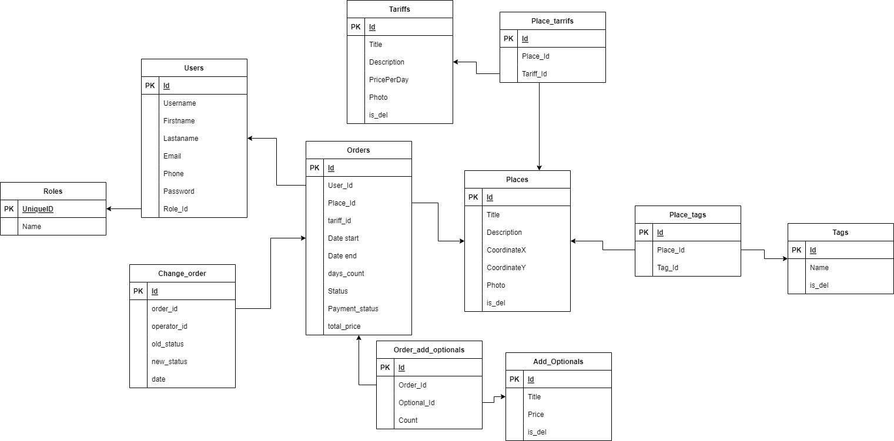

# Таблицы
## Пользователи
User
- id
- username
- firstname
- lastname
- email
- phone
- password
- role_Id

## Role
Roles
- id
- name

## Места
Places
- id
- title
- description
- coordinatex
- coordinatey
- photo (URL фотографий)
- is_del


## Тарифы
Tariffs
- id
- title
- description
- price_per_day
- photo (URL фотографий)
- is_del

## Заказы
Orders
- id
- user_Id
- place_Id
- tariff_id
- date_start
- date_end
- days_count
- status
- payment_status
- total_price

## Теги
Tags
- id
- name
- is_del

## Опции
Additonal Options
- id
- title
- price
- is_del

## Order_add_options
- id
- order_id
- option_id
- count

## Place_tags
- id
- place_id
- tag_id

## Place_tariffs
- id
- place_id
- tariff_id

## Change_order
- id
- order_id
- operator_id
- old_status
- new_status
- date


**Enum Status**:
- Обрабатывается
- В пути
- Доставлено
- Отменено
- Ошибка

**Enum payment status**:
- Оплачено
- Не оплачено



# Эндпоинты 

## Авторизация
### POST sign up
`POST /api/auth/signup`

input:
```json
{
	"username":"username",
	"firstname":"firstname",
	"lastname":"lastname",
	"email":"useremail@mail.ru",
	"phone":"89528125252",
	"password":"password12345"
}
```
output:
```json
{
  "message": "User registered successfully!"
}
```

### POST sign in
`POST /api/auth/signin`

input:
```json
{
	"username":"username",
	"password":"password12345"
}
```
output:
```json
{
	"token":"eyJhbGciOiJIUzUxMiJ9",
    "type": "Bearer",
    "id": 3,
    "username": "username",
    "firstname": "username",
    "lastname": "username", 
    "email": "username@asd.ru",
    "role": "ROLE_USER"
}
```

## Пользователь
### GET users info
`GET /api/user/info`
**auth**

output:
```json
{
	"username":"username",
	"firstname":"firstname",
	"lastname":"lastname",
	"email":"useremail@mail.ru",
	"phone":"89528125252"
}
```


### PATCH update user details
`PATCH /api/user`
**auth**

input:
```json
{
	"username":"username",
	"firstname":"firstname",
	"lastname":"lastname",
	"email":"useremail@mail.ru",
	"phone":"89528125252"
}
```
output:
```json
{
	"username":"username",
	"firstname":"firstname",
	"lastname":"lastname",
	"email":"useremail@mail.ru",
	"phone":"89528125252"
}
```

## Place
### GET all place previews around
`GET /api/place`
**auth**

Input: 
Query:
- XСoordinate - Double
- YСoordinate - Double
- radius - Double. в километрах (default 50)

Output:
```json
{
	"places":[
		{
			"id":0, 
			"title":"some place 0",
			"XCoordinate":56.2853,
			"YCoordinate":42.0971
		  },
	  { 
			"id":1, 
			"title":"some place 1", 
			"XCoordinate":36.2853, 
			"YCoordinate":52.0971
		}
	]
}
```

### GET place by id
`GET /api/place/:id`

**auth**

Input:

Path: `id - Long`

Output:
```json
{
	"id":0,
	"title":"some place", 
	"description":"some descriptin", 
	"XCoordinate":52.5252,
	"YCoordinate":34.4333,
	"tags":[
		"tag1", 
		"tag2", 
		"tagde"
	], 
	"tariffs":[
		{
			"id":1,
			"title":"title1",
			"description":"desc",
			"price_per_day":5000.0, 
			"photo":"url1"
		}
	], 
	"photo":"url1"
}
```

### POST create place
`POST /api/place`

**auth admin**

Input:
```json
{
	"title":"new plave title",
	"description":"new description", 
	"XCoordinate":52.0808,
	"YCoordinate":12.1489,
	"tags":[1, 5, 4], 
	"tariffs":[1, 2, 3, 4, 7],
	"photo":"url1"
}
```

Output:
```json
{
	"id":0,
	"title":"some place", 
	"description":"some descriptin", 
	"XCoordinate":52.5252,
	"YCoordinate":34.4333,
	"tags":[
		"tag1", 
		"tag2", 
		"tagde"
	], 
	"tariffs":[
		{
			"id":1,
			"title":"title1",
			"description":"desc",
			"price_per_day":5000.0, 
			"photo":"url" 
		}
	], 
	"photo":"url1"
}
```

 
### PATCH update place info
`PATCH /api/place/:id`

**auth admin**

если `tags` или `tariffs` пустые, то удалятся 

Input:

Path: `id - int`

```json
{
	"title":"new plave title",
	"description":"new description", 
	"XCoordinate":52.0808,
	"YCoordinate":12.1489,
	"tags":[1, 5, 4], 
	"tariffs":[1, 2, 3, 4, 7],
	"photos":"url1"
}
```

Output:
```json
{
	"id":0,
	"title":"some place", 
	"description":"some descriptin", 
	"XCoordinate":52.5252,
	"YCoordinate":34.4333,
	"tags":[
		"tag1", 
		"tag2", 
		"tagde"
	], 
	"tariffs":[
		{
			"id":1,
			"title":"title1",
			"description":"desc",
			"price_per_day":5000.0, 
			"photo":"url" 
		}
	], 
	"photos":"url1"
}
```

### DELETE place
`DELETE /api/place/:id`

**auth admin**

Input: `id - int`

Soft delete

Output: 200 ok

## Orders
### POST create order
`POST /api/order`
**auth**

input:
```json
{
	"place_id":1,
	"days_count":5,
	"tarrif_id":0,
	"optional_ids":[0,2]
}
```

output:
```json
{
	"id":0,
	"user":{
		"id":0,
		"username":"username0",
		"firstname":"vlad",
		"lastname":"suvorov",
        "email":"mail@mail.ru",
		"phone":"89528120252"
	},
	"place":{
		"id":0,
		"title":"sometitle",
		"XCoordinate":52.2552,
		"YCoordinate":52.5252
	},
	"tariff":{
		"id":0,
		"title":"title",
		"description":"description",
		"price_per_day":5000.0,
        "photo":"url"
	},
	"days_count":5,
	"status":"Обрабатывается",
	"date_start":"2017-03-12T13:37:27+00:00",
	"date_end":"2017-03-17T13:37:27+00:00",
	"additional_options":[
		{
			"id":0,
			"title":"opt0",
			"price":200.0,
			"count":1
		},
		{
			"id":2,
			"title":"opt2",
			"price":100.0,
			"count":4
		}
	],
	"total_price":25600.0,
	"payment_status":"Не оплачено"
}
```

### GET order by id
`GET /api/order/:id`

input: id - int,

output:
```json
{
	"id":0,
	"user":{
		"id":0,
		"username":"username0",
		"firstname":"vlad",
		"lastname":"suvorov",
		"phone":"89528120252"
	},
	"place":{
		"id":0,
		"title":"sometitle",
		"description":"description",
		"XCoordinate":52.2552,
		"YCoordinate":52.5252
	},
	"tariff":{
		"id":0,
		"title":"title",
		"description":"description",
		"price_per_day":5000.0
	},
	"days_count":5,
	"status":"Обрабатывается",
	"date_start":"2017-03-12T13:37:27+00:00",
	"date_end":"2017-03-17T13:37:27+00:00",
	"additional_oprions":[
		{
			"id":0,
			"title":"opt0",
			"price":200.0,
			"count":1
		},
		{
			"id":2,
			"title":"opt2",
			"price":100.0,
			"count":4
		}
	],
	"total_price":25600.0,
	"payment_status":"Не оплачено"
}
```

### GET users by user_id order previews. for Admin
`GET /api/order/user/:id`

**auth admin**

input: username - string

output:
```json
{
	"orders":[
		{
			"id":0,
			"place":{
				"id":0,
				"title":"title"
			},
			"status":"На месте",
			"payment_status":"Оплачено",
			"days_count":5,
			"total_price":25600.0
		},
		{
			"id":1,
			"place":{
				"id":1,
				"title":"title"
			},
			"status":"В пути",
			"payment_status":"Оплачено",
			"days_count":2,
			"total_price":16300.0
		}
	]
}
```

### GET user order previews. for User
`GET /api/order`

input: 

output:
```json
{
	"orders":[
		{
			"id":0,
			"place":{
				"id":0,
				"title":"title"
			},
			"status":"На месте",
			"payment_status":"Оплачено",
			"days_count":5,
			"total_price":25600.0
		},
		{
			"id":1,
			"place":{
				"id":1,
				"title":"title"
			},
			"status":"В пути",
			"payment_status":"Оплачено",
			"days_count":2,
			"total_price":16300.0
		}
	]
}
```

### PATCH поменять статус order'а
`PATCH /api/order/:id/process`

**auth admin**
input: id - int

query: 
- status


### PATCH отменить заказ
`PATCH /api/order/:id/cancel`

**auth**

input: id - int


### Оплата, посмотреть сервисы оплаты и как это можно обработать на беке
-> меняется статус оплаты в Order'е


## Tarrif
### GET all tariffs
`GET /api/tariff`

input: -

output:
```json
{
	"tariffs":[
		{
			"id":0,
			"title":"title0",
			"description":"description0",
			"price_per_day":500.0,
			"photo":"url0"
		},
		{
			"id":1,
			"title":"title1",
			"description":"description1",
			"price_per_day":400.0,
			"photo":"url1"
		},
		{
			"id":2,
			"title":"title2",
			"description":"description2",
			"price_per_day":50000.0,
			"photo":"url2"
		}
	]
}
```

### POST create tariff
`POST /api/tariff`

**auth admin**

input:
```json
{
	"title":"title2",
	"description":"description2",
	"price_per_day":50000.0,
	"photo":"url2"
}
```

output:
```json
{
	"id":2,
	"title":"title2",
	"description":"description2",
	"price_per_day":50000.0,
	"photo":"url2"
}
```

### PATCH update tariff
`PATCH /api/tariff/:id`

**auth admin**

input: id - int

```json
{
	"title":"title2",
	"description":"description2",
	"price_per_day":50000.0,
	"photo":"url2"
}
```

output:
```json
{
	"id":2,
	"title":"title2",
	"description":"description2",
	"price_per_day":50000.0,
	"photo":"url2"
}
```

### DELETE delete tariff
`DELETE /api/tariff/:id`

**auth admin**

input: id - int

output: ok 200


## Options
### GET all options
`GET /api/option`

input: -

output:
```json
{
	"options":[
		{
			"id":0,
			"title":"title0",
			"price":200.0
		},
		{
			"id":1,
			"title":"title1",
			"price":100.0
		},
		{
			"id":2,
			"title":"title2",
			"price":400.0
		}
	]
}
```

### POST create option
`POST /api/option`
**auth admin**

input:

Query:
- title - string
- price - double


output:
```json
{
	"id":2,
	"title":"title2",
	"price":400.0
}
```


### PATCH update option
`PATCH /api/option/:id`
**auth admin**

input: id - int

```json
{
	"title":"title",
	"price":200.0
}
```

output:
```json
{
	"id":2,
	"title":"title2",
	"price":400.0
}
```

### DELETE option
`DELETE /api/option/:id`

input: id - int
output: ok

## Tag
### GET all tags
`GET /api/tag`

input: - 

output:
```json
{
	"tags":[
		{
			"id":0,
			"name":"tag0"
		},
		{
			"id":1,
			"name":"tag1"
		},
		{
			"id":2,
			"name":"tag2"
		}
	]
}
```

### POST tag
`POST /api/tag`

**auth admin**

input:

Query: `name - string`

output:
```json
{
	"id":1,
	"name":"tag1"
}
```

### DELETE tag
`DELETE /api/tag/:id`

**auth admin**

input: id - int 
output:
200 ok